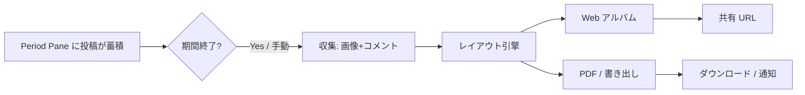

# 🌙 妄想 01 — 時系列タブから自動アルバム生成

> **分類:** `[妄想]` `[Archive]` `[SpacePane]` — **実装予定なし・思考実験**
> **関連:**
> - [93_Hossiiタブ機能追加](../現在の仕様/93_Hossiiタブ機能追加.md) — タブ（SpacePane）基盤
> - [100_スペースタブDnDとカゴ](../現在の仕様/100_スペースタブDnDとカゴ.md) — タブ整理
> - [68_スペース書き出し機能](../現在の仕様/68_スペース書き出し機能%20.md) — 1枚キャプチャ・PDF 系
> - [12_画像投稿](../現在の仕様/12_画像投稿.md) / [72_Hossii要約やコメント機能](../現在の仕様/72_Hossii要約やコメント機能.md)
> - [space-product-vision.md](../../space-product-vision.md) §2.3 Archive Layer

> **ステータス:** 🌙 **妄想** — アイデアメモ
> **最終更新:** 2026-06-29

---

## 0. 一言で

**「週ごと」「月ごと」など時系列で続けて作ったタブに溜まった Hossii（写真・コメント・気持ち）から、期間末にアルバムが勝手に出来上がる。**

手元に残るのはスペースの「その週の空気」そのもの。ZINE や年間振り返りの素材になる。

---

## 1. きっかけ（ユーザーの声）

> タブによって時系列的にまとめられたものを、例えば1年間にわたって一週間ごと、１ヶ月ごと、継続的なタブを作ることでてきたものから、アルバムが自動で生成される（投稿された写真＋コメントとか）みたいなことができたらいいな。

---

## 2. 妄想の核心

| 要素 | イメージ |
|------|---------|
| **時系列タブ** | 「第1週」「2月」「2026-W12」のように **期間が名前・意味を持つ Pane** |
| **継続運用** | 管理者が毎週／毎月タブを1つ足す（または **自動生成**） |
| **自然な蓄積** | 各タブに通常どおり Hossii を投稿。写真・短文・気持ちが期間ごとに分かれる |
| **自動アルバム** | 期間が閉じたタイミング（または手動トリガー）で **そのタブ中身からアルバムが生成** |
| **成果物** | スクロールできる Web アルバム / PDF / 共有リンク — 「その週を振り返る1冊」 |

**Hossii らしさ:** 整理しすぎない。アルバムも **ふわっとしたレイアウト**（吹き出し・星・余白）で、堅いレポートにならない。

---

## 3. 利用シーン（ストーリー）

### 3.1 教室・ワークショップ（週次）

```text
9月第1週タブ → 写真10枚 + 気づきコメント
9月第2週タブ → …
…
12月 → 「2025年 秋学期 アルバム」が自動で1冊
```

- 毎週の振り返りタブを続けるだけ
- 学期末に保護者・参加者へ **アルバム URL** を渡す

### 3.2 チームの内省スペース（月次）

```text
1月タブ / 2月タブ / … / 12月タブ
→ 年末に「2026 ふりかえりアルバム」（写真＋代表コメント＋月ごと章立て）
```

### 3.3 個人ログ（日次〜週次）

```text
「今週の自分」タブを52個
→ 1年後に **自分だけの年鑑** ができる
```

---

## 4. 概念モデル（妄想レベル）

### 4.1 時系列 Pane = **Period Pane**

通常の `SpacePane` に **期間メタデータ** を持たせるイメージ（将来の拡張案）。

```typescript
// 妄想 — スキーマ未確定
type PeriodPaneMeta = {
  kind: 'period';
  /** この Pane が表す期間 */
  range: {
    start: string; // ISO date
    end: string;   // inclusive or exclusive TBD
  };
  /** 繰り返し系列への所属 */
  series?: {
    id: string;
    cadence: 'daily' | 'weekly' | 'monthly' | 'custom';
    index: number; // 第12週、2026-03 など
    labelTemplate?: string; // "{{year}}年 {{month}}月"
  };
  /** 期間終了後の挙動 */
  onClose?: 'archive' | 'lock' | 'none';
};
```

| 状態 | 意味 |
|------|------|
| **open** | いま投稿できる「今週のタブ」 |
| **closed** | 期間終了。閲覧のみ or アルバム生成待ち |
| **archived** | アルバム化済み。タブバーからは [100 のカゴ](../現在の仕様/100_スペースタブDnDとカゴ.md) へ |

### 4.2 アルバム = **Period Album**

```typescript
// 妄想
type PeriodAlbum = {
  id: string;
  spaceId: string;
  sourcePaneIds: string[];  // 1 Pane から、または複数 Pane を束ねてもよい
  title: string;            // 自動: "2026年3月" / 手動上書き可
  generatedAt: string;
  /** 中身 */
  pages: AlbumPage[];
  /** 出力 */
  exports?: {
    webUrl?: string;
    pdfStoragePath?: string;
  };
};

type AlbumPage = {
  layout: 'photo_grid' | 'photo_with_quote' | 'timeline' | 'mood_collage';
  items: AlbumItem[];  // Hossii id 参照 + 配置ヒント
};

type AlbumItem = {
  hossiiId: string;
  role: 'hero' | 'supporting' | 'caption';
  excerpt?: string;   // 長文は要約 or 抜粋
};
```

**自動生成の入力:**

- 対象 Pane 内の Hossii（`space_pane_id` 一致）
- 優先: **画像付き投稿**、次に **テキスト＋気持ち**
- 除外: 非表示・削除済み・管理者のみ非公開（将来）

---

## 5. 自動アルバム生成 — ざっくりフロー



### 5.1 トリガー（妄想）

| トリガー | 説明 |
|---------|------|
| **スケジュール** | 毎週月曜 0:00 に前週 Pane を close → アルバム生成 |
| **手動** | 管理者「このタブからアルバムを作る」 |
| **系列一括** | 「2026年の月次タブ12個 → 年間アルバム1冊」 |

### 5.2 レイアウト引擎（妄想）

ルールベースで十分な初版イメージ:

1. 画像投稿を日付順に並べる
2. 各画像に **近い日付の短文コメント** をキャプションとしてペアリング
3. 気持ちタグが多い週は **色の帯** or ムードページを1枚挟む
4. 枚数が多いときは **ベスト N + 「もっと見る」**（全件は Web のみ）

AI 要約（[72](../現在の仕様/72_Hossii要約やコメント機能.md)）は **任意レイヤー**:

- 章扉に「この週のひとこと」（AI 下書き → 管理者承認）

### 5.3 成果物の形

| 形式 | 用途 |
|------|------|
| **Web アルバム** | スマホでサッと見る。横スワイプ / 縦スクロール |
| **PDF** | [68](../現在の仕様/68_スペース書き出し機能%20.md) の延長。印刷・配布 |
| **スライドショー** | [19_スライドショー画面](../現在の仕様/19_スライドショー画面の追加.md) との接続 |

---

## 6. UI 妄想

### 6.1 タブバー

```text
[ 今週 ] [ 先週 ] [ 2週前 ] … [ 🧺 過去 ] [ ＋ ]
                                    ↑ 100 のカゴと相性良い
```

- **今週だけ** がアクティブ投稿先（設定で変更可）
- 過去タブはカゴ or アルバムアイコン 📖 に集約

### 6.2 アルバム一覧

スペース設定 or 専用「アルバム」タブ:

```text
📖 2026年3月（32枚・12コメント）  [見る] [PDF]
📖 2026年2月（28枚・8コメント）
📖 2025 年間まとめ
```

### 6.3 アルバム閲覧

- 表紙: 期間ラベル + 代表写真1枚 + 背景は Pane の壁紙を薄く
- 本文:  Masonry 風 or 1写真1ページ
- 各ページに **元 Hossii へのリンク**（スペース内ジャンプ）

---

## 7. 既存機能との接続

| 既存 | 妄想での役割 |
|------|-------------|
| **SpacePane（93）** | 期間タブの器。`settings.period` 的な拡張 |
| **space_pane_id 付き投稿** | アルバムのソースデータ |
| **カゴ（100）** | 終了した期間タブの整理先 |
| **書き出し（68）** | 1枚 PNG → 複数ページ PDF へ発展 |
| **Archive Layer（vision）** | 商品思想の「持ち帰れる成果物」に直結 |

---

## 8. 前提・未解決（妄想のまま残す）

| # | 問い |
|---|------|
| Q1 | Period Pane は **手動作成** vs **cron で自動生成** どちらが主？ |
| Q2 | 1アルバム = 1 Pane 固定？ 月次12 Pane → 年間1冊の **束ね** は？ |
| Q3 | 参加者全員がアルバム閲覧可？ 外部共有は？ |
| Q4 | 画像なしタブはテキストアルバムになる？ 最低投稿数 threshold？ |
| Q5 | ストレージコスト（PDF・サムネイル生成）の上限 |
| Q6 | 個人アカウント（97）と「自分の年鑑」の関係 |

---

## 9. もし本番化するなら（超ざっくり Phase）

> **注意:** ここから先は妄想の延長。工数・優先度は未評価。

| Phase | 内容 |
|-------|------|
| **P0** | 93 タブ + 画像投稿 + Pane 紐付けが安定（**いまここ**） |
| **P1** | Pane に `period` メタ手動設定 + 「この Pane から PDF グリッド」手動ボタン |
| **P2** | 週次 Pane テンプレ + 期間終了 close + Web アルバム自動生成 |
| **P3** | 系列（weekly/monthly）自動 Pane 生成 + カゴ連携 |
| **P4** | 年間束ね・AI 章扉・共有 URL・通知 |

---

## 10. 成功イメージ（定性）

- 管理者: 「タブを増やし続けるだけで、期末に渡すものが勝手にある」
- 参加者: 「あの週の写真と言葉が、1冊にまとまって見返せる」
- Hossii: スペースが **入力ツール** から **記憶のアルバム** になる

---

## 11. 変更履歴

| 日付 | 内容 |
|------|------|
| 2026-06-29 | 初版 — 時系列タブ × 自動アルバム生成の妄想メモ |
