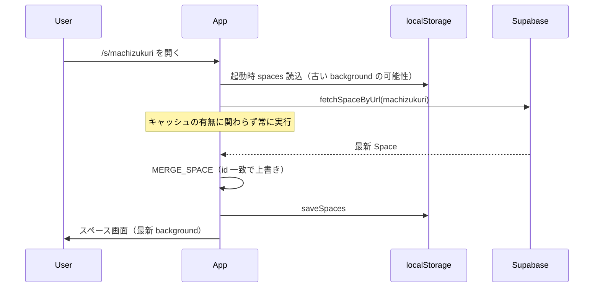

# 82 スペース情報キャッシュ再同期

> **分類:** `[Core / Bugfix]` slug アクセス・localStorage キャッシュと Supabase の整合  
> **関連:** [03_スペースURL機能](./03_スペースURL機能.md) / [04_データ保存機能](./04_データ保存機能.md) / [24_スペース管理_各スペースの設定_背景設定](./24_スペース管理_各スペースの設定_背景設定.md) / [14_スペース背景画像登録機能](./14_スペース背景画像登録機能.md)

> 最終更新: 2026-06-23  
> **ステータス:** ✅ 実装済み

---

## 1. 背景

スペース一覧は起動時に `localStorage` の `hossii.spaces` から読み込み、続けて Supabase の `fetchSpaces` で上書き同期する。  
slug 直リンク（`/s/[slug]`・`/c/*/s/[slug]`）では、一覧 fetch を待たず **`fetchSpaceByUrl` で1件取得** するファストパスがある（[03 §URL 経由のスペースアクセスフロー](./03_スペースURL機能.md)）。

**正（Source of Truth）:** Supabase `spaces` テーブル  
**キャッシュ:** 端末の `localStorage` — オフライン即時表示用。サーバーと矛盾したら **サーバーを優先** する。

---

## 2. 問題（再現済み）

### 2.1 症状

| 項目 | 内容 |
|------|------|
| 例 | スペース **地域まちづくり論0622**（`space_url: machizukuri`） |
| PC | 差し替えた背景画像が表示される |
| スマホ通常モード | 背景が変わらない（旧パターン mist のまま等） |
| スマホプライベートモード | 正しい背景が表示される |
| Supabase | `background.kind = image`・`source = cloud`・画像 URL は 200 OK — **DB は正常** |

### 2.2 原因

`App.tsx` の slug ファストパスに次のロジックがある。

```
localStorage に同じ spaceURL のスペースがあれば fetchSpaceByUrl をスキップ
```

背景を **設定する前** に一度その slug でアクセスした端末では、**古い `background` が localStorage に残る**。  
スキップにより Supabase から再取得されず、通常モードでは古い見た目が続く。

プライベートモードは localStorage が空 → `fetchSpaceByUrl` が走る → 正しい背景になる。

### 2.3 影響範囲

| フィールド | 古いキャッシュが残りうる例 |
|-----------|---------------------------|
| `background` | 背景画像・パターン変更後 |
| `savedBackgroundImages` | ギャラリー追加・削除後 |
| `name` | スペース名変更後 |
| `isPrivate` | 公開設定変更後 |
| `presetTags` 等 | 設定変更後 |

投稿（hossiis）は Realtime / `fetchHossiis` で別途同期するため、本問題の直接対象外。

---

## 3. 修正方針

### 3.1 基本原則

1. **slug 直アクセス時は、localStorage にキャッシュがあっても `fetchSpaceByUrl` を必ず実行する**（Revalidate always）
2. 取得結果は **マージ** する。同一 `id` のスペースが state にあれば **上書き更新**、なければ追加
3. マージ後は `saveSpaces` で localStorage を更新
4. [03 §初回 not-found 誤表示防止](./03_スペースURL機能.md) は維持する（fetch 完了前に not-found にしない）

### 3.2 slug ファストパス（変更後）



| 項目 | 変更前 | 変更後 |
|------|--------|--------|
| キャッシュヒット時 | fetch スキップ | **fetch 実行** |
| 取得成功 | `addSpaceLocal` のみ（重複追加の恐れ） | **`addSpaceLocal` → `MERGE_SPACE`**（id 一致なら UPDATE） |
| 取得失敗 | キャッシュを使用 | キャッシュを使用（従来どおりフォールバック） |

### 3.3 マージ対象フィールド

サーバー（`fetchSpaceByUrl` / `SET_SPACES`）を正とし、以下を上書きする。

| フィールド | 備考 |
|-----------|------|
| `name` | |
| `spaceURL` | |
| `background` | **本件の主対象** |
| `savedBackgroundImages` | |
| `cardType` | |
| `quickEmotions` | |
| `isPrivate` | |
| `presetTags` | |
| `welcomeMessage` | 将来追加時も同様 |

**マージしない（端末ローカル優先）:** なし — Space エンティティ全体をサーバー優先。

**`id`・`createdAt`:** 変更しない（同一レコードの更新のみ）。

### 3.4 `SET_SPACES` との関係

| 経路 | 挙動 |
|------|------|
| ログイン後 `fetchSpaces` → `SET_SPACES` | **現状維持**。一覧をサーバーで置換 |
| slug `fetchSpaceByUrl` | 本仕様で **常時 Revalidate + MERGE** |
| 競合 | 同一 `id` ならどちらもサーバー内容。後着の fetch が最終状態になる |

slug 直アクセスが `SET_SPACES` より先に完了しても、後から `SET_SPACES` が来れば再度サーバー内容で上書きされる。  
逆に `SET_SPACES` 後に slug Revalidate が走っても、同じ DB 内容なら見た目は変わらない。

### 3.5 slug 以外（`#screen` から入室）

| 経路 | 対応 |
|------|------|
| ハッシュ `#screen` のみ | `fetchSpaces` 完了後の `SET_SPACES` に依存（現状維持） |
| `fetchSpaces` 失敗 | 古い localStorage が残る — **本仕様のスコープ外**（将来: リトライ） |

---

## 4. 実装仕様

### 4.1 Store: `MERGE_SPACE` / `addSpaceLocal`

| 項目 | 内容 |
|------|------|
| 種別 | `MERGE_SPACE` action（`HossiiStoreProvider` reducer） |
| 公開 API | `addSpaceLocal(space)` — 内部で `dispatch({ type: 'MERGE_SPACE', payload: space })` |
| 入力 | Supabase から取得した `Space` 1件 |
| 処理 | `state.spaces` に同 `id` があれば `{ ...existing, ...incoming }` で置換。なければ末尾に追加 |
| 永続化 | reducer 内で `saveSpaces` |

### 4.2 App.tsx slug ファストパス

| 項目 | 変更 |
|------|------|
| 削除 | キャッシュヒット時の early return（fetch スキップ） |
| 追加 | 常に `fetchSpaceByUrl(slug)` |
| 成功 | `addSpaceLocal(space)` |
| 失敗 | `slugFetchOutcome = 'miss'`。キャッシュがあれば従来どおり入室可 |

`slugFetchOutcome` の `hit` は **fetch 成功** または **fetch 失敗だがキャッシュで slug 解決** のときに設定（not-found 判定用。03 と整合）。

### 4.3 表示タイミング

| 方針 | 内容 |
|------|------|
| 採用 | **Stale-while-revalidate** |
| 詳細 | キャッシュがあれば入室処理は従来どおり進めてよい。fetch 完了後に `background` 等が差し替わり、**背景だけ短時間で切り替わる** ことがある |
| 理由 | 初回表示の体感速度を維持。not-found 防止ロジックとも両立 |

---

## 5. 受け入れ条件

| # | 条件 | 状態 |
|---|------|------|
| AC-1 | PC で背景画像を変更後、**スマホ通常モード**で同じ slug URL を開くと、新しい背景が表示される | ✅ |
| AC-2 | Supabase に存在しない slug は、fetch 完了後に not-found（03 既存挙動） | ✅ |
| AC-3 | 初回 QR / slug アクセスで、fetch 完了前に not-found が一瞬出ない（03 回帰なし） | ✅ |
| AC-4 | 同一 `id` のスペースが `state.spaces` に二重登録されない | ✅ |
| AC-5 | `fetchSpaceByUrl` 失敗時、キャッシュがあれば従来どおり入室できる | ✅ |
| AC-6 | temp 背景（`source: temp`）は引き続き localStorage に永続化しない（[04](./04_データ保存機能.md)・`saveSpaces` 既存仕様） | ✅ |

---

## 6. 手動テスト

1. スマホ通常モードで slug アクセス（背景 mist の状態を localStorage に作る）
2. PC で同スペースの背景を画像に変更（Supabase 保存確認）
3. スマホで **タブを閉じず** 同 slug を再読み込み → 新背景になること
4. スマホプライベートモードでも同様に表示されること
5. 存在しない slug → not-found（fetch 後）
6. 初回 slug アクセス（localStorage 空）→ not-found が先に出ないこと

---

## 7. 実装ファイル

| ファイル | 変更内容 |
|----------|---------|
| `src/App.tsx` | slug ファストパス: キャッシュヒット時の fetch スキップを削除。`fetchSpaceByUrl` を **常時実行**（Stale-while-revalidate）。成功時 `addSpaceLocal(space)` |
| `src/core/hooks/HossiiStoreProvider.tsx` | `MERGE_SPACE` action 追加。`addSpaceLocal` は内部で `MERGE_SPACE` に委譲（同一 `id` は `{ ...existing, ...incoming }` で上書き、なければ追加）。`saveSpaces` で localStorage 同期 |
| `docs/仕様書/現在の仕様/03_スペースURL機能.md` | §slug キャッシュ再同期・実装ステータス表を更新 |

### 7.1 実装メモ

| 項目 | 実装 |
|------|------|
| キャッシュヒット時の UX | キャッシュがあれば `slugFetchOutcome = 'hit'` を先に設定し入室を進める。fetch 完了後に `background` 等が差し替わる |
| `addSpaceLocal` | 新規 INSERT ではなく **MERGE** のみ（重複 id 追加なし） |
| fetch 失敗 | キャッシュがあれば `slugFetchOutcome = 'hit'` のまま入室可。なければ `'miss'` → not-found |
| `SET_SPACES` との競合 | 後着の fetch が最終状態。同一 DB 内容なら見た目は変わらない |

---

## 8. 関連仕様書の更新

| ドキュメント | 更新内容 | 状態 |
|-------------|---------|------|
| [03_スペースURL機能](./03_スペースURL機能.md) | slug キャッシュ再同期・実装ステータス | ✅ |
| [04_データ保存機能](./04_データ保存機能.md) | temp 背景の非永続化（既存仕様・変更なし） | — |
| [24_背景設定](./24_スペース管理_各スペースの設定_背景設定.md) | 背景変更後の端末間同期の前提 | 参照のみ |

---

## 9. 変更履歴

| 日付 | 内容 |
|------|------|
| 2026-06-22 | 初版。地域まちづくり論0622 の調査結果を反映 |
| 2026-06-23 | 実装完了。`MERGE_SPACE`・slug 常時 Revalidate |
| 2026-06-23 | 仕様書更新。受け入れ条件・実装ファイル・関連ドキュメント表を実装反映 |
