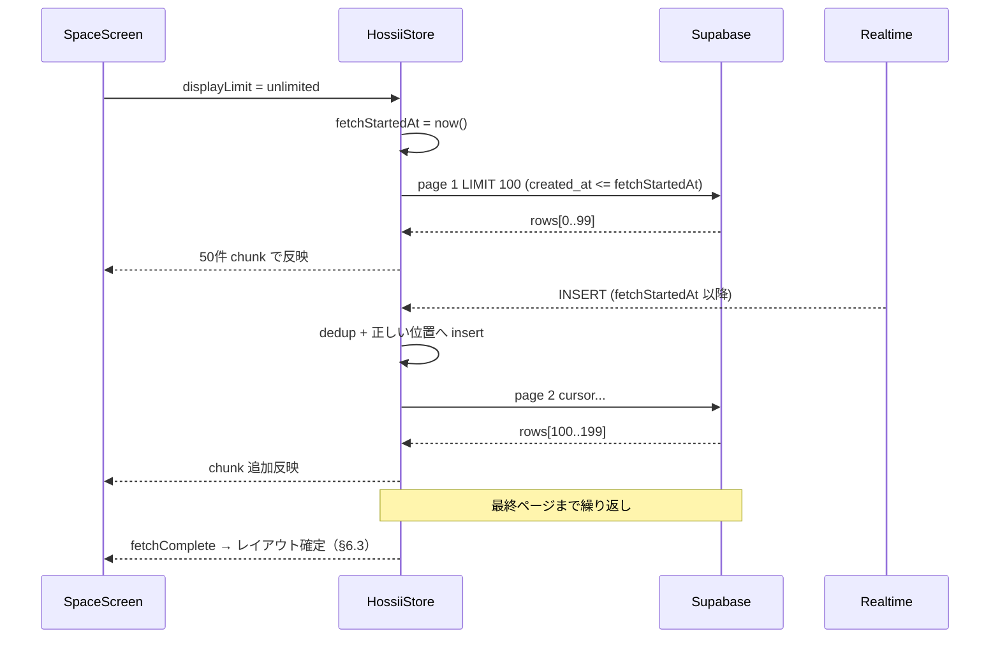
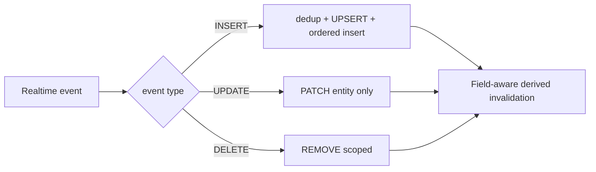
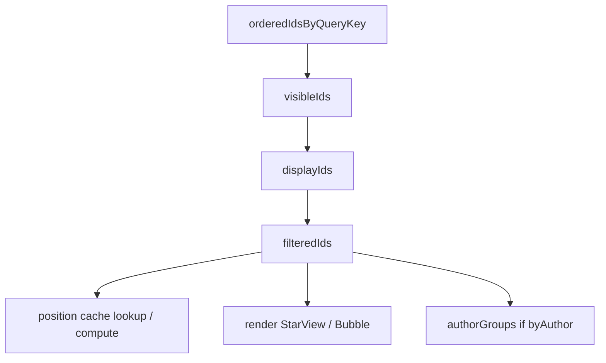

# 87 スペース表示パフォーマンス最適化

> **分類:** `[Core / Performance]` スペース画面の取得・状態・描画・アニメーション最適化
> **関連:**
> - [08_スペース（HOME）の仕様書](./08_スペース（HOME）の仕様書.md) / [53_スペース投稿表示並び替え](./53_スペース投稿表示並び替え.md)
> - [81_投稿者別まとめ表示モード](./81_投稿者別まとめ表示モード.md) / [84_スペース表示モード拡張](./84_スペース表示モード拡張.md)
> - [04_データ保存機能](./04_データ保存機能.md) / [45_投稿の位置を定める機能](./45_投稿の位置を定める機能.md)
> - [78_スマホ投稿配置と16比9領域](./78_スマホ投稿配置と16比9領域.md) / [36_ぐるぐる読み込み改善](./36_ぐるぐる読み込み改善.md)

> **ステータス:** ✅ 実装済み（P0–P7 / 2026-06-23）
> **最終更新:** 2026-06-23（実装完了・計測手順追記）

---

## 1. 背景・課題

### 1.1 症状

| 環境 | 症状 |
|------|------|
| PC | 投稿数が増えるとスペース画面（`#screen`）が重くなる |
| スマホ | さらに顕著。操作がほぼ追いつかない程度まで劣化しうる |

### 1.2 改善前のボトルネック（2026-06 時点・参考）

| 領域 | 改善前 | 問題 |
|------|------|------|
| **取得** | `fetchHossiis` がスペース内 **全件** `select('*')` | 表示 50 件でも数千件をメモリに載せる |
| **状態** | `state.hossiis: Hossii[]` 単一配列 | INSERT/UPDATE のたび配列全体をコピー |
| **localStorage** | 更新のたび `saveHossiis` で **全件 JSON 化** | 投稿増で main thread ブロック |
| **描画前処理** | 毎レンダーで全件 filter + sort + slice | `displayLimit` より多い件数も毎回処理 |
| **React** | `StarView` / `Bubble` 未メモ化、単一 `HossiiContext` | Realtime 1 件更新で Context 購読全体が再評価 |
| **アニメ** | 各 `StarView` に pulse + float + twinkle（3 本） | 50 件 = 150 本の常時 CSS アニメ |
| **Bubble** | 各吹き出しに `backdrop-filter` + `bubbleFloat` | compositor 負荷が件数に比例 |

### 1.3 改善後の実装（2026-06-23）

| 領域 | 現状 |
|------|------|
| **取得** | `fetchHossiisPage` + 複合 cursor。`useSpaceHossiiFetch`（Abort / requestId）。全件は upperBound snapshot + 100 件/page |
| **状態** | `entitiesById` + `orderedIdsByQueryKey`。`hossiis[]` は互換 adapter |
| **localStorage** | Supabase 有効時は全件 serialize 停止（demo のみ 200 件 cap） |
| **描画** | `runDisplayPipeline`（visible → display slice → tag filter） |
| **React** | `React.memo` + `useHossiiEntity`（`useSyncExternalStore`）+ `HossiiActionsContext` |
| **アニメ** | tier full/light/none + `useVisibleAnimationLevel`（IO で画面外 none） |
| **#comments** | `useCommentsHossiiFetch`（queryKey `period:all`）で別 fetch |

### 1.4 本仕様の方針

**ユーザーが選べる表示件数（50 / 100 / 150 / 全件）は維持**する。全件表示が必要なユースケース（イベント全体の俯瞰、書き出し前確認など）を残す。

そのうえで、**取得・状態・再計算・再描画・アニメーション** の対象を、選択された表示件数と画面に必要な範囲に限定する。

**基本方針（維持）:**

| 方針 | 内容 |
|------|------|
| 表示件数 UI | 50 / 100 / 150 / 全件を維持 |
| 全件時のアニメ | 表示件数に関わらず常時アニメ対象は限定（§8） |
| 取得 | Supabase から必要件数だけ取得 |
| Realtime | 差分更新（全件 refetch しない） |
| localStorage | 投稿全件保存を廃止（Supabase 有効時） |
| 座標 | いいね等の UPDATE では再計算しない（§6） |

---

## 2. スコープ

### 2.1 対象

| 対象 | 内容 |
|------|------|
| スペース画面 | `#screen`（`SpaceScreen.tsx`） |
| データ層 | `hossiisApi.ts`、`HossiiStoreProvider.tsx` |
| 表示コンポーネント | `StarView.tsx`、`Tree.tsx`（Bubble）、`AuthorClusterBubble.tsx` |
| 表示設定 | `displayPrefsStorage.ts`（表示件数・期間・モードは現行 UI を維持） |
| Realtime | hossiis の INSERT / UPDATE / DELETE 購読 |

### 2.2 対象外・影響範囲（初版）

| 項目 | 方針 |
|------|------|
| `#comments` ログ一覧の仮想スクロール | 別画面。初版は SpaceScreen 専用 selector / fetch 戦略 |
| `#comments` / `MyLogsScreen` / `StarLayer` | `getActiveSpaceHossiis()` 依存。**store 正規化時は取得経路を分離または別 selector で回帰防止**（§5.5） |
| モデレーションタブの全件取得 | 管理者専用。現行 `fetchAllHossiisForModeration` を維持 |
| Supabase 未設定デモビルド | オフライン demo 用に最小限のフォールバックは残す（§10） |
| Canvas / WebGL への描画方式変更 | DOM 最適化を優先 |

---

## 3. 表示件数 UI（変更なし）

左バー `LeftControlBar` の **表示件数** 選択肢は現行どおり維持する。

| 値 | ラベル（現行） | 本仕様での意味 |
|----|--------------|--------------|
| `50` | 50件 | Supabase から **最新 50 件** を取得対象とする |
| `100` | 100件 | **最新 100 件** |
| `150` | 150件 | **最新 150 件** |
| `'unlimited'` | 全件 | **ページング取得**（§4.4）。UI 上は「全件」 |

- デフォルト: `50`（`displayPrefsStorage.ts` の `DEFAULT_LIMIT`）
- 永続化キー: `hossii.displayLimit`（変更なし）
- **全件表示機能は削除しない**

---

## 4. データ取得

### 4.1 基本原則

| 原則 | 内容 |
|------|------|
| 正（Source of Truth） | Supabase `hossiis` テーブル |
| クエリ側フィルタ | `space_id`、期間（`created_at`）、非表示除外、ソート、件数上限を **可能な限り DB で処理** |
| クライアント slice | 表示件数変更で **再取得が不要な場合は取得済みデータを再利用** |
| 段階表示 | 全件モードでは **取得できた分から順次 UI に反映** |
| ページング | **keyset pagination**（`created_at` + `id` 複合 cursor。§4.2） |
| stale 対策 | query 条件変更時は **AbortController + requestId**（§4.8） |

### 4.2 通常モード（50 / 100 / 150）

#### ソート・cursor（必須）

**並び順（全 fetch で統一）:**

```sql
ORDER BY created_at DESC, id DESC
```

**cursor 型:**

```typescript
cursor?: { createdAt: string; id: string };
```

**次ページ取得条件（keyset pagination）:**

同一 `created_at` に複数投稿があっても **重複・欠落が起きない** 複合キーを使う。

```sql
WHERE space_id = :activeSpaceId
  AND (is_hidden = false OR is_hidden IS NULL)
  AND created_at >= cutoff(P)          -- P !== 'all' のとき
  AND (
    created_at < :cursorCreatedAt
    OR (
      created_at = :cursorCreatedAt
      AND id < :cursorId
    )
  )
ORDER BY created_at DESC, id DESC
LIMIT :limit
```

> **禁止:** `WHERE created_at < T_min` のみの cursor。同一時刻の投稿で欠落・重複が起きうる。

#### 初回・スペース切替・期間変更時

```
displayLimit = N（50 | 100 | 150）
displayPeriod = P（1d | 1w | 1m | all）
queryKey = buildQueryKey(spaceId, P, serverFilterHash)  -- §4.8
↓
Supabase: 最新 N 件を §4.2 の ORDER BY で取得（cursor なし）
```

#### 表示件数を **増やした** とき（例: 50 → 100）

| 条件 | 動作 |
|------|------|
| 取得済み 50 件、要求 100 件 | **不足 50 件だけ** 追加取得（§4.2 複合 cursor） |
| 期間・DB フィルタ条件が同一 | 追加取得のみ。既存 50 件は破棄しない |

**追加取得例:**

```
orderedIds の最古 (createdAt, id) を cursor とする
→ LIMIT (100 - 50) で §4.2 の keyset 条件を適用
```

#### 表示件数を **減らした** とき（例: 100 → 50）

| 動作 |
|------|
| **再取得しない** |
| `orderedIds` は維持。`displayIds` は selector で先頭 50 件に slice（§7） |
| store の reducer action は発行しない |

#### 表示件数を **全件 → 有限** に戻したとき

**必ず再 fetch しない。** 以下で判断する。

| 条件 | 動作 |
|------|------|
| 必要件数をすでに取得済み | 再 fetch せず **取得済みデータを再利用** |
| 全件取得途中だが必要件数は取得済み | in-flight fetch を **abort** し、取得済みデータを再利用 |
| 必要件数が不足 | **不足分だけ** 追加 fetch |
| 期間や DB フィルタ条件が変わっている | queryKey 変更として **新規 fetch**（§4.8） |

### 4.3 期間フィルタ（displayPeriod）

| 期間 | UI ラベル（現行） | Supabase 条件 | 備考 |
|------|-----------------|--------------|------|
| `1d` | 1日 | `created_at >= now() - 1 day` | |
| `1w` | 1週 | `created_at >= now() - 7 days` | |
| `1m` | 1月 | `created_at >= now() - 30 days` | **暦月ではない。「直近30日」固定** |
| `all` | 全期間 | 期間条件なし | |

期間変更時は **queryKey が変わる** ため §4.8 に従い fetch 状態をリセットし、現在の `displayLimit` に応じて再取得する。

### 4.4 全件モード（`displayLimit === 'unlimited'`）

#### ページサイズ

| 定数 | 値 | 備考 |
|------|-----|------|
| `HOSSII_PAGE_SIZE` | **100** | 1 リクエストあたりの取得件数（調整可） |
| `UI_COMMIT_CHUNK_SIZE` | **50** | UI 反映を chunk 分割する単位（§4.4 段階表示） |

#### snapshot 上界（Realtime 整合・必須）

全件取得開始時に **snapshot upper bound** を記録する。

```typescript
const fetchStartedAt = new Date().toISOString();
```

ページング取得は原則として以下に固定する。

```sql
created_at <= :fetchStartedAt
```

| 項目 | 仕様 |
|------|------|
| 取得開始 **前** の投稿 | ページングで順次取得 |
| 取得開始 **後** の新規投稿 | **Realtime INSERT** で受け取る |
| dedup | fetch 結果・Realtime payload・optimistic 投稿を **ID（または clientGeneratedId）で dedup** |
| orderedIds | 常に `created_at DESC, id DESC` を維持 |
| ページ追加 | 既存 ID を除外して append |
| Realtime INSERT | 単純 prepend ではなく、必要に応じて **正しい位置へ挿入** |
| UPDATE で createdAt 変更 | **そのときのみ** 並び順を再評価 |

#### フロー



| 項目 | 仕様 |
|------|------|
| 段階表示 | fetch は 100 件単位。**UI 反映は 50 件以下の chunk** に分割（`requestIdleCallback` または同等） |
| ローディング UI | 右上またはスペース中央に **「読み込み中… (N件)」** |
| 中断 | スペース切替・期間変更・有限件数への変更で **進行中 fetch を abort** |
| ソート | 常に `created_at DESC, id DESC`。クライアント再ソート不要 |
| long task | ページ追加ごとの main thread block を Performance API で計測（§14.2） |

### 4.5 タグ絞り込み（スペース画面）

タグ絞り込み（[84](./84_スペース表示モード拡張.md)）は **取得後の表示 ID リストに対するクライアント側フィルタ** として維持する（初版）。

> **初版のタグ絞り込みは、現在取得済みかつ表示件数の範囲内にある投稿のみを対象とする。全期間から対象タグの投稿を DB 検索して取得する動作は、Supabase 側フィルタ対応時に実装する（将来対応）。**

| 例 | 挙動 |
|----|------|
| 表示件数 50 件 | Supabase から取得した **最新 50 件の中** からタグで絞り込む |
| 51 件目以前に同タグの投稿 | 初版では **表示対象に含めない** |
| 将来 | DB 側でタグ一致投稿を最大 N 件取得 |

| 項目 | 方針 |
|------|------|
| Supabase JSONB フィルタ | **将来最適化候補**（U3）。初版はクライアント filter |
| 再取得 | タグ変更だけでは **DB 再 fetch しない**（§7） |
| queryKey | 初版では **タグ条件を含めない**（タグ変更で fetch リセットしない） |

### 4.6 Realtime との整合

| イベント | 取得層の動作 |
|----------|-------------|
| INSERT | Realtime payload を正とし、§5.3 の差分 merge。dedup 後、orderedIds へ **正しい位置** に insert |
| UPDATE | 対象 ID の entity のみ差し替え。§6.1 のフィールド別 derived 無効化 |
| DELETE | 対象 ID を entity map と **該当 queryKey の** orderedIds から除去 |

Realtime 受信時に **全件 refetch しない**。

### 4.7 API 追加（実装指針）

`src/core/utils/hossiisApi.ts` に追加:

```typescript
type FetchHossiisPageParams = {
  spaceId: string;
  limit: number;
  cursor?: { createdAt: string; id: string };
  periodCutoff?: Date | null;
  upperBound?: string | null; // 全件モード: fetchStartedAt
  signal?: AbortSignal;
};

// 返却: { items: Hossii[]; nextCursor: { createdAt, id } | null; hasMore: boolean }
fetchHossiisPage(params: FetchHossiisPageParams): Promise<...>
```

既存 `fetchHossiis(spaceId)` は **モデレーション・後方互換** 用に残すか、内部で page ループに委譲する。

### 4.8 fetch 状態の query 条件単位管理（必須）

`fetchMetaBySpaceId` と `orderedIdsBySpaceId` だけでは、**同一スペース内で期間条件が変わった際にデータが混ざる** 可能性がある。

#### queryKey

```typescript
type HossiiQueryKey = `${spaceId}:${displayPeriod}:${serverFilterHash}`;
// 将来 DB 側タグフィルタ追加時: serverFilterHash に tag 条件を含める
```

| フィールド | 管理単位 |
|-----------|---------|
| `orderedIdsByQueryKey` | queryKey → 新しい順 ID 一覧 |
| `fetchMetaByQueryKey` | queryKey → fetch メタ |

```typescript
type FetchMeta = {
  displayLimit: DisplayLimit;
  displayPeriod: DisplayPeriod;
  fetchedCount: number;
  hasMore: boolean;
  isFetching: boolean;
  fetchComplete: boolean;
  fetchStartedAt?: string;       // unlimited 時
  requestId: number;             // stale レスポンス破棄用
};
```

#### 条件変更時の必須処理

`displayPeriod` / `displayLimit` / DB フィルタ / `spaceId` 変更時:

1. `orderedIdsByQueryKey`（旧 key）を初期化または参照切替
2. `cursor` を初期化
3. `fetchMeta` を初期化
4. **`requestId`（generation）をインクリメント**
5. 進行中リクエストを **AbortController で中断**
6. レスポンス反映時に **`requestId` が最新か確認**。古い場合は **破棄**（Abort のみに依存しない）

---

## 5. 状態管理

### 5.1 正規化ストア構造

投稿を **単一配列** で持たず、次の層に分離する。

```typescript
type HossiiEntitiesState = {
  /** 投稿 ID → 投稿本体 */
  entitiesById: Record<string, Hossii>;
  /** queryKey → 新しい順の投稿 ID 一覧（取得済み範囲） */
  orderedIdsByQueryKey: Record<HossiiQueryKey, string[]>;
  /** queryKey ごとの取得メタ */
  fetchMetaByQueryKey: Record<HossiiQueryKey, FetchMeta>;
};
```

| フィールド | 役割 |
|-----------|------|
| `entitiesById` | Realtime UPDATE で **1 エントリだけ** 新参照に差し替え |
| `orderedIdsByQueryKey` | 表示順のソース。filter 結果は **別 derived 状態**（§7） |
| `fetchMetaByQueryKey` | ページング・ローディング・増分 fetch・stale 判定 |

> **PATCH 時:** 更新対象 entity **のみ** 新オブジェクト参照にする。他 ID の entity 参照は維持（§9.1 memo の前提）。

### 5.2 Reducer アクション（差分更新）

| アクション | 動作 |
|-----------|------|
| `UPSERT_HOSSII` | `entitiesById[id]` を merge。該当 queryKey の orderedIds に未登録なら **正しい位置** に insert |
| `UPSERT_HOSSII_BATCH` | ページ取得結果を一括 merge。ID dedup 後 append |
| `PATCH_HOSSII` | Realtime UPDATE。該当 entity のみ **新参照** で shallow merge |
| `REMOVE_HOSSII` | entity 削除 + **該当 spaceId / queryKey の orderedIds からのみ** id 除去 |
| `SET_ORDERED_IDS` | queryKey の ID リストを置換（初回 fetch 完了時） |
| `APPEND_ORDERED_IDS` | ページング追加分を **重複除外** して連結 |

**削除時の spaceId 取得:** DELETE payload に `spaceId` が無い場合は、削除前の `entitiesById[id].spaceId` から取得する。

**禁止:**

- `UPDATE 1 件 → hossiis 全配列コピー → saveHossiis 全件`
- `REMOVE_HOSSII` で **全 queryKey / 全 space を走査** して id 除去
- `TRIM_DISPLAY_IDS` 等、表示件数変更用の reducer action（§7 で derived 化）

### 5.3 Realtime ハンドラ



- INSERT: 楽観投稿との dedup は現行 `insertedHossiiIdsRef` ロジックを **拡張** して維持
- UPDATE: §6.1 のフィールド別ルールに従い derived を無効化

### 5.4 メモリ上限（推奨・初版はソフト制限）

| 条件 | 動作 |
|------|------|
| 有限表示（50/100/150） | 取得済み件数 ≤ max(displayLimit, 現在要求) + **バッファ 50** 程度 |
| 全件モード | 原則全 entity 保持。将来 **上限超過時の古い entity eviction** を検討 |

### 5.5 他画面との store 共有

| 画面 | 初版方針 |
|------|---------|
| `#screen` | queryKey ベースの limited fetch + derived pipeline |
| `#comments` / `#mylogs` | 初版は **別 fetch または別 selector** で回帰防止。共有 `entitiesById` 化は段階的 |
| 訪問モード（`visitingHossiis`） | 既存フローを維持。正規化移行時に影響確認 |

---

## 6. フィルタ・ソート・レイアウト

### 6.1 再計算トリガー

**毎フレーム／毎レンダーで全投稿を filter + sort しない。**

#### Derived 状態とトリガー

| Derived 状態 | 再計算トリガー |
|-------------|--------------|
| `visibleIds`（期間・非表示・viewMode 適用後） | `orderedIds`, `displayPeriod`, `viewMode`, 対象 entity の `isHidden` 変更 |
| `displayIds`（件数上限適用） | `visibleIds`, `displayLimit`（**selector 内 slice。reducer 不要**） |
| `filteredIds`（タグ） | `displayIds`, `activeTagFilter` |
| `authorGroups` | `filteredIds`, `layoutMode`, `authorGroupSort`, author 関連変更 |
| `bubblePositions` | `filteredIds`, `layoutMode`, `shouldMapToSharp`, **新規 ID 追加** |

```typescript
// displayIds は derived（TRIM action なし）
const displayIds =
  displayLimit === 'unlimited'
    ? visibleIds
    : visibleIds.slice(0, displayLimit);
```

#### Realtime UPDATE: フィールド別 derived 無効化

| 変更フィールド | orderedIds | displayIds | bubblePositions | authorGroups | random seed |
|--------------|:----------:|:----------:|:---------------:|:------------:|:-----------:|
| `likeCount` のみ | — | — | — | — | — |
| `message`, `imageUrl`, `bubbleColor` 等表示属性 | — | — | — | — | — |
| `createdAt` | **再評価** | **再評価** | **再評価** | **再評価** | — |
| `spaceId` | **再評価** | **再評価** | **再評価** | **再評価** | — |
| `isHidden` | **再評価** | **再評価** | **再評価** | **再評価** | — |
| `authorId`, `authorName` | — | — | — | **再評価** | — |
| `tags`, `hashtags` | — | **再評価**（タグ filter 時） | **再評価** | **再評価** | — |
| `positionX`, `positionY`, `scale` | — | — | **再評価** | — | — |

**再計算しない UI 状態:**

- 星プレビュー rotation（`previewHossiiIds` 変更）
- ホバー・選択状態の変更

### 6.2 座標の安定性

| レイアウト | 方針 |
|-----------|------|
| **ランダム** | 投稿 ID をシードにした **決定論的配置**（現行 index 依存を **id 依存** に移行） |
| DB 保存座標 | `positionX/Y` はいいね等では変更しない |
| **投稿順（ordered）** | 格子計算結果を `{ [hossiiId]: {x,y} }` に **キャッシュ**。`filteredIds` の並びが変わったときだけ再計算 |
| **投稿者まとめ（byAuthor）** | `authorGroups` 再計算時のみ cluster 座標を更新 |

```typescript
type PositionCacheKey = `${spaceId}:${layoutMode}:${sharpRectHash}`;
positionsByHossiiId: Record<string, { x: number; y: number }>;
```

- `sharpRectHash`: モバイル壁紙の 16:9 矩形が変わったときのみ invalidation（[78](./78_スマホ投稿配置と16比9領域.md)）

### 6.3 全件取得中のレイアウト

| layoutMode | 取得中の挙動 |
|------------|-------------|
| `random` | 取得済み分から **随時配置可能** |
| `ordered` | 取得済み分で **暫定格子**。列数は可能な限り固定し chunk 追加時の再計算を抑制 |
| `byAuthor` | **fetchComplete まで**「投稿者を整理しています…」オーバーレイ。**完了後に一括レイアウト** |

---

## 7. 表示パイプライン（Derived Data）



各段階は `useMemo` または selector 関数で実装し、**入力参照が変わったときのみ** 再計算する。

**表示件数変更（100→50）:** `orderedIds` は不変。`displayIds` selector の slice だけが変わる。

---

## 8. アニメーション

### 8.1 原則

| 原則 | 内容 |
|------|------|
| 表示件数 ≠ アニメ件数 | 画面上の件数が 150 でも、常時アニメ **DOM** は **最大 30 + 例外** |
| 新しい投稿ほどリッチ | 最新 10 件がフルアニメ |
| 古い投稿は静止 | 31 件目以降はデフォルト `none` |
| インタラクション時 | 選択・ホバー・プレビュー対象は **一時的にレベル昇格**（同時昇格数は極力限定） |
| 画面外 | Intersection Observer で **アニメ停止** |

**DOM 数と CSS Animation 本数の区別:**

| 指標 | 上限（通常時） |
|------|--------------|
| 常時アニメーション対象 **DOM** | 最大 **30 要素**（full 10 + light 20） |
| `full` 対象 | 最大 **10 要素** |
| `light` 対象 | 最大 **20 要素** |
| **CSS Animation インスタンス** | 原則最大 **50 本**（10×3 + 20×1） |
| ホバー・選択・プレビュー等の一時昇格 | 別枠。同時昇格数を極力限定 |

### 8.2 アニメーションレベル

`StarView` / `Bubble` に共通 prop:

```typescript
type AnimationLevel = 'full' | 'light' | 'none';
```

| レベル | StarView（現行 CSS 対応） | Bubble |
|--------|--------------------------|--------|
| `full` | pulse + float + twinkle | bubbleFloat + 通常 hover |
| `light` | **twinkle のみ**（または float のみ。実装時に 1 種に固定） | 静止。hover のみ |
| `none` | アニメなし | アニメなし |

### 8.3 レベル決定ルール

`displayIds` 内の **新しい順インデックス**（0 = 最新）で決定:

| インデックス | デフォルト level |
|-------------|-----------------|
| 0〜9 | `full` |
| 10〜29 | `light` |
| 30〜 | `none` |

**昇格（一時的に `full` 相当）:**

| 条件 | 昇格 |
|------|------|
| `selectedPostId === id` | `full` |
| `hoveredHossiiId === id`（PC 星モード） | `full` |
| `previewHossiiIds.has(id)` | `full` |
| `activeBubbleId === id` | `full` |
| `recentHighlightIds.has(id)` | `light` 以上 |

**降格:** 条件解除時は **インデックスベースのデフォルトに戻す**。

### 8.4 画面外・画像の最適化

| 対象 | 仕様 |
|------|------|
| アニメ | `IntersectionObserver`（rootMargin 付き）で **画面内または margin 内** に入った要素のみアニメ有効。非表示時 `animationLevel` を強制 `none` |
| 画像 | `loading="lazy"`。**IO で画面内または rootMargin 内に入った時点で `src` を設定**。必要に応じ `HTMLImageElement.decode()` |
| プレビュー吹き出し | 画面内 + level 昇格時のみ DOM 生成 |
| 画面外 | 高解像度画像・プレビュー詳細 DOM を **生成しない** |
| `backdrop-filter` | 31 件目以降の Bubble は **不透明背景にフォールバック**（blur なし） |

### 8.5 全件モード

- 常時アニメ対象は **§8.3 と同じく最大 30 DOM + 例外**
- 1000 件表示中でも GPU 負荷は **full ≤ 10, light ≤ 20, CSS Animation ~50 本** に上限

### 8.6 表示スタック（z-index）

ランダム配置（`layoutMode !== 'ordered'`）では、アニメ tier 対象（index ≤ 29）の投稿を **手前のレイヤー** に描画し、31 件目以降の静止投稿に隠れないようにする。

**実装:** `animationLevel.ts` の `displayStackZFromIndex(index)`。`SpaceScreen` が `StarView` / `Bubble` に `orderedStackZ`（ランダム時は `displayStackZ`）として渡す。

| インデックス | z-index（目安） | 備考 |
|-------------|----------------|------|
| 0（最新） | 80 | 最前面 |
| 29 | 51 | アニメ tier 最古 |
| 30〜 | 15 → 1 | 静止層。重なり時は古いほど奥 |

| 項目 | 仕様 |
|------|------|
| 投稿順（`ordered`） | 格子 index ベースの `orderedStackZ` を **優先**（本節の index ベース z は使わない） |
| ホバー・選択 | 既存 CSS（`.bubbleStack` / `.starOrderedStack.starHighlight`）でさらに前面へ |
| テスト | `animationLevel.test.ts` — index 0 > 29 > 30 の順序 |

### 8.7 PC 星プレビュー回転（84 §14 連携・✅ 実装済み）

[84 §14](./84_スペース表示モード拡張.md) のローテプレビュー対象星（最大 **6** 件）に付与する **回転 + previewBob** は、§8.3 の tier とは **別枠** とする。

| 指標 | 上限 |
|------|------|
| 回転対象 DOM | **6**（`previewHossiiIds` のみ） |
| 追加 CSS Animation / 星 | 回転 1 + twinkle 1 ≒ **2 本** |
| 追加 CSS Animation / 吹き出し | previewBob **1 本**（吹き出し 6 件まで） |
| tier との関係 | 回転星も `animationLevel` を尊重。`none` でも回転候補なら twinkle のみ併用 |

実装時は `document.getAnimations().length` が §14.9 AC の許容範囲内であることを確認する。

---

## 9. React 再描画

### 9.1 購読単位（必須）

`React.memo` と正規化 store だけでは、**Realtime UPDATE 時に該当投稿だけが re-render される保証はない**。

現行 `HossiiStoreProvider` は単一 `HossiiContext` を配布しており、`state` 更新のたびに Context 購読側全体が再評価される。

**以下のいずれか（または組み合わせ）を採用する:**

| 方式 | 内容 |
|------|------|
| **A. 投稿 ID 単位購読** | `useSyncExternalStore` で `entitiesById[id]` を購読 |
| **B. selector store** | Zustand 等で selector 購読（CLAUDE.md の将来移行方針と整合） |
| **C. Context 分割** | entities / actions / UI 状態を分離 |
| **D. 親から安定 entity 参照** | 親が id ごとに参照を維持し、子へ **対象投稿だけ** を渡す |

> **投稿コンポーネントは投稿 ID 単位の selector で購読するか、親から参照が維持された entity を受け取る。Context 全体の更新によって全投稿が再評価されない構造とする。**

### 9.2 コンポーネントメモ化

| コンポーネント | 対応 |
|---------------|------|
| `StarView` | `React.memo` |
| `Bubble` | `React.memo` |
| `AuthorClusterBubble` | `React.memo` |

**比較条件（必須）:**

- **`hossii.id` だけでは不十分。** 同一 ID でも本文・いいね数・色・画像・表示状態・投稿者情報・更新日時が変わる
- **推奨:** 正規化 store で PATCH 時に **該当 entity のみ新参照** にし、`prev.hossii === next.hossii` で比較
- **代替:** 必要な表示値だけを個別 props で渡し、それぞれ比較

```typescript
// 推奨
function propsAreEqual(prev: StarViewProps, next: StarViewProps) {
  return (
    prev.hossii === next.hossii &&
    prev.x === next.x &&
    prev.y === next.y &&
    prev.animationLevel === next.animationLevel
    // ... その他 UI 状態
  );
}
```

### 9.3 コールバック安定化

| 現状 | 変更後 |
|------|--------|
| `onClick={() => setSelectedPostId(hossii.id)}` | `useCallback` ファクトリ or **単一 handler + data-id** |
| map 内 inline object | 座標・style は **memo 済み子** 内で組み立て |

### 9.4 Realtime 1 件 UPDATE 時

```
PATCH_HOSSII(id) → entitiesById[id] を新参照に更新
  → 購読している StarView/Bubble(id) のみ re-render
  → likeCount のみ変更時: orderedIds / positions / authorGroups は不変
  → SpaceScreen 本体は derived 結果が変わらなければ skip
```

### 9.5 プレビューローテ（6 秒）

| 現状 | 変更後 |
|------|--------|
| `setPreviewHossiiIds` → 全 StarView 再評価 | **旧 preview セットと新 preview セットの diff** だけ level 更新 |
| | 可能なら `previewHossiiIds` を Context 化し StarView 配下のみ購読 |

---

## 10. ローカル保存（localStorage）

### 10.1 保存をやめるもの

| キー / 処理 | 変更 |
|------------|------|
| `hossii.hossiis` / `saveHossiis` | **Supabase 有効時は投稿の都度保存を廃止** |
| 全件 JSON 化 | Realtime / fetch ごとの `saveHossiis(newHossiis)` を削除 |

### 10.2 引き続き localStorage に保存するもの

| 種別 | 例 |
|------|-----|
| 表示設定 | `displayLimit`, `displayPeriod`, `viewMode`, `layoutMode` |
| UI 状態 | `presentationMode`, `spaceTagFilter.{spaceId}`, `logScope` |
| 下書き | 吹き出し色、投稿パネル下書き |
| プロフィール（匿名） | 端末ローカル nick 等（現行どおり） |
| スペース一覧キャッシュ | `hossii.spaces`（[82](./82_スペース情報キャッシュ再同期.md)） |

### 10.3 投稿キャッシュ（任意・最小）

Supabase 有効時も **オフライン一時表示** が必要なら:

| 項目 | 上限 |
|------|------|
| 直近 optimistic 投稿 | **最大 10 件** |
| キー | `hossii.hossiis.recent`（新規。旧キーとは分離） |
| 用途 | 送信直後〜 Realtime 反映前のフラッシュ防止のみ |

**正式な投稿データの正は Supabase のみ。**

### 10.4 Supabase 未設定（デモ）時

| 動作 |
|------|
| 従来どおり `hossii.hossiis` で永続化可 |
| ただし **最大 200 件** 等のソフト上限を設け、デモでも性能劣化を防ぐ |

---

## 11. ローディング・エラー UI

| 状態 | UI |
|------|-----|
| 初回 fetch 中（0 件） | スペース背景上にスケルトン or スピナー |
| 全件ページング中 | 「読み込み中… (現在 N 件)」バッジ（`spaceTopRightCluster` 付近） |
| `byAuthor` + 全件未完了 | 半透明オーバーレイ + 文言 |
| fetch 失敗 | トースト + リトライ。取得済み分は維持 |
| abort（スペース切替） | エラー表示しない |

**実装上の注意（fetch フック）:** `useSpaceHossiiFetch` / `useCommentsHossiiFetch` は `onFetched`・`onLoadingChange` を **ref 経由** で effect 内から呼び出す。親が `useCallback` 未整備でコールバック参照が毎 render 変わると、effect が再実行 → abort → `onLoadingChange(true)` ループとなり **初回ローディングが終わらない**（2026-06-23 修正）。`SpaceScreen` 側は `handleSpaceFetched` を `useCallback` で安定化する。

---

## 12. 実装フェーズ（推奨）

### 12.1 フェーズ一覧

| Phase | 内容 | 依存 |
|-------|------|------|
| **P0** | 複合 cursor pagination、`fetchHossiisPage`、有限件数 fetch、**requestId + AbortController**、Supabase 時 **saveHossiis 廃止** | — |
| **P1** | 正規化 store（entities + orderedIdsByQueryKey + fetchMetaByQueryKey）、Realtime 差分 + dedup | P0 |
| **P2** | Derived pipeline（displayIds selector / positions cache）、フィールド別 derived 無効化 | P1 |
| **P3** | 投稿 ID 単位購読 or selector store、entity 参照安定化 | P1 |
| **P4** | `React.memo` + callback 安定化 + preview diff 更新 | P3 |
| **P5** | `AnimationLevel` + IntersectionObserver + Bubble blur 制限 + 画像遅延読み込み | P2（P0 と並行可） |
| **P6** | unlimited paging + snapshot upper bound + UI chunk 段階表示 + byAuthor 完了待ち | P0, P1 |
| **P7** | Performance 計測、回帰テスト、関連仕様書更新 | 全 |

### 12.2 コスパ優先の前倒し（任意）

store 大改修前に **体感改善** を得るため、以下は P5 の一部を P0 と **並行** してよい:

| タスク | 効果 | diff |
|--------|------|------|
| Supabase 有効時 `saveHossiis` 停止 | main thread 長ブロック解消 | 小 |
| `AnimationLevel` CSS tier | スマホ GPU 負荷大幅削減 | 小〜中 |
| IO で画面外アニメ停止 | 同上 | 小 |
| Bubble 31 件目以降 blur オフ | PC compositor 改善 | 小 |

---

## 13. 変更ファイル（予定）

| ファイル | 変更概要 |
|----------|----------|
| `src/core/utils/hossiisApi.ts` | ページング API（複合 cursor、upperBound） |
| `src/core/hooks/HossiiStoreProvider.tsx` | 正規化 state、queryKey、差分 reducer、fetch 戦略 |
| `src/core/utils/storage.ts` | saveHossiis 縮小 / recent cache |
| `src/components/SpaceScreen/SpaceScreen.tsx` | derived selectors、incremental fetch 連携 |
| `src/components/SpaceScreen/StarView.tsx` | `animationLevel`、memo、IO |
| `src/components/SpaceScreen/Tree.tsx` | `animationLevel`、memo、blur フォールバック |
| `src/core/utils/bubblePosition.ts` | id ベースシード |
| `src/core/hooks/useVisibleAnimationLevel.ts`（新規） | level 決定 + IO |
| `src/core/utils/hossiiDisplayPipeline.ts`（新規） | visibleIds / displayIds 純関数 |
| `src/core/hooks/useHossiiEntity.ts`（新規・任意） | id 単位購読 |

---

## 14. 受け入れ条件

### 14.1 機能

- [ ] 表示件数 50 / 100 / 150 / 全件 の UI が現行どおり選択できる
- [ ] 50→100 変更で不足分のみ追加取得される
- [ ] 100→50 変更で再 fetch せず表示が切り替わる（derived slice）
- [ ] 全件→50/100/150 に戻した際、取得済みデータを **再利用**（不要な再 fetch なし）
- [ ] 全件モードで 100 件ずつ fetch、**50 件 chunk** で段階表示される
- [ ] 同一 `created_at` の投稿が複数あってもページングで **重複・欠落しない**
- [ ] 全件取得中に Realtime INSERT が発生しても **重複しない**（dedup + 正しい insert 位置）
- [ ] optimistic 投稿、fetch 結果、Realtime INSERT が **1 件に dedup** される
- [ ] 期間切替後に古い fetch が完了しても state を **汚さない**（requestId 破棄）
- [ ] タグ絞り込みは初版では **取得済み・表示件数内のみ** を対象とする
- [ ] Realtime INSERT / UPDATE / DELETE が個別反映され、いいね UPDATE で他投稿の座標がずれない
- [ ] いいね更新で **該当投稿の表示値だけ** が更新される
- [ ] `React.memo` により本文・いいね更新が **取りこぼされない**

### 14.2 性能（目標値・要実機計測）

| 条件 | 目標 |
|------|------|
| 表示 50 件・PC | Realtime UPDATE 1 件時の React commit **< 16ms**（Profiler） |
| 表示 50 件・スマホ | 操作可能（スクロール/タップ 300ms 以内応答） |
| 通常時 | 常時アニメーション対象 **DOM ≤ 30 要素** |
| 通常時 | **CSS Animation インスタンス ~50 本以内**（`document.getAnimations().length` 参考） |
| 全件 paging | ページ追加時に **長時間の main thread block（long task）が発生しない** |
| Supabase 有効時 | 投稿更新のたび `localStorage` 全件 serialize **が発生しない** |

### 14.3 回帰

- [ ] [84](./84_スペース表示モード拡張.md) タグ絞り込み・星トグルが動作
- [ ] [81](./81_投稿者別まとめ表示モード.md) 投稿者まとめ（全件完了後レイアウト含む）
- [ ] [78](./78_スマホ投稿配置と16比9領域.md) モバイル壁紙座標
- [ ] 楽観投稿 → Realtime 反映 → 重複なし
- [ ] `#comments` / モデレーションは従来どおり（store 変更の影響範囲を限定）
- [ ] 初回 fetch 後にローディングスピナーが **解除** される（fetch フック callback ref）
- [ ] 最新 30 件以内の星・バブルが静止層より **手前** に表示される（§8.6）

---

## 15. テスト計画

| # | シナリオ |
|---|----------|
| T1 | 空スペース → 50 件 fetch → 表示 |
| T2 | 50 件表示中に 100 件へ変更 → network が追加 50 件のみ |
| T3 | 100→50 に変更 → network 追加なし、displayIds slice のみ |
| T4 | unlimited 選択 → 250 件スペースで 3 ページ段階表示（chunk 反映） |
| T5 | unlimited + byAuthor → 完了前オーバーレイ → 完了後クラスタ表示 |
| T6 | Realtime でいいね → 該当 Bubble のみ再描画、likeCount 表示更新（Profiler） |
| T7 | 31 件目以降 StarView が none、ホバーで full |
| T8 | 画面外 → IO でアニメ停止 |
| T9 | スペース切替 → abort → 前スペースの fetch が state を汚さない |
| T10 | 期間切替 → requestId 更新 → 古いレスポンス破棄 |
| T11 | 同一 created_at の投稿複数 → ページングで重複・欠落なし |
| T12 | 全件取得中 Realtime INSERT → dedup、順序維持 |
| T13 | 全件→50 に戻す → 再 fetch なしで再利用 |
| T14 | タグ絞り込み → 取得済み 50 件内のみ対象（51 件目以前は出ない） |
| T15 | memo: いいね更新後も表示が stale にならない |
| T16 | ページ追加時 long task が許容範囲内 |
| T17 | Supabase オフ demo → 200 件上限で動作 |
| T18 | `displayStackZFromIndex`: index 0 が 29 より手前、29 が 30 より手前 |
| T19 | 不安定な `onFetched` 参照でも fetch effect が **ループしない** |

---

## 16. 未決事項

| # | 項目 | 候補 |
|---|------|------|
| U1 | `light` の CSS 定義 | twinkle のみ vs float のみ |
| U2 | entity eviction 上限 | 有限表示時のバッファ 50 で十分か |
| U3 | タグを Supabase 側 filter にするタイミング | Phase 2 以降。queryKey に tag を含める |
| U4 | `#comments` も同 store / 同 fetch を使うか | ✅ 初版: 正規化 store 共有 + `useCommentsHossiiFetch`（queryKey `period:all`）で別 fetch |
| U5 | Zustand 全面移行 vs useSyncExternalStore | ✅ 初版: `useHossiiEntity` + `useSyncExternalStore`。Zustand は将来 |

---

## 17. 変更履歴

| 日付 | 内容 |
|------|------|
| 2026-06-23 | 初版作成（取得・正規化 store・アニメ tier・React 最適化・localStorage 方針） |
| 2026-06-23 | ChatGPT レビュー反映: 複合 cursor、queryKey fetch 状態、タグ初版スコープ、snapshot upper bound、React 購読/memo 修正、アニメ DOM/CSS 区別、derived TRIM、全件→有限再利用、テスト拡充、フェーズ再編 |
| 2026-06-23 | **P0–P7 実装完了**: `fetchHossiisPage` / 正規化 store / `runDisplayPipeline` / id 座標キャッシュ / `React.memo` + `useHossiiEntity` / IO アニメ / unlimited paging + byAuthor オーバーレイ / vitest 拡充 |
| 2026-06-23 | 追補: §8.6 表示スタック z-index、`useSpaceHossiiFetch` callback ref（無限ローディング防止）、§11 注意 |
| 2026-06-23 | §8.7 追記: [84 §14](./84_スペース表示モード拡張.md) PC 星プレビュー回転の DOM/CSS 予算 |
| 2026-06-23 | §8.7 **実装済み**（`StarView.module.css` `.starPreviewRotate` / `previewBob`） |

---

## 18. 実装サマリ・計測手順

### 18.1 主要ファイル（実装済み）

| 領域 | ファイル |
|------|----------|
| Fetch | `src/core/hooks/useSpaceHossiiFetch.ts`, `src/core/utils/hossiisApi.ts` |
| Store | `src/core/hooks/HossiiStoreProvider.tsx`, `src/core/utils/hossiiEntitiesState.ts` |
| Pipeline | `src/core/utils/hossiiDisplayPipeline.ts`, `src/core/utils/hossiiPositionCache.ts` |
| React | `src/core/hooks/useHossiiEntity.ts`, `src/core/hooks/useHossiiActions.ts`, `StarView` / `Tree` / `AuthorClusterBubble` memo |
| アニメ | `src/core/hooks/useVisibleAnimationLevel.ts`, `src/core/utils/animationLevel.ts`（`displayStackZFromIndex` — §8.6） |
| CSS | `SpaceScreen.module.css`（`.bubbleStack`）, `StarView.module.css`（`.starOrderedStack.starHighlight`） |
| 永続化 | `src/core/utils/hossiiPersistence.ts`（Supabase 時 localStorage 全件 serialize 停止） |

### 18.2 手動計測（§14.2 / §15）

1. **React Profiler**: `#screen` で Realtime いいね 1 件 → 該当 StarView/Bubble のみ commit（T6, T15）
2. **Long task**: DevTools Performance → unlimited paging 中の main thread（T16）
3. **CSS アニメ数**: コンソール `document.getAnimations().length` — 目標 ~50 以下（§14.2）
4. **DOM 数**: Elements パネルで StarView プレビュー DOM ≤30（§14.2）

### 18.3 自動テスト

`npm run test` — `hossiiFetchPage`, `hossiiDisplayPipeline`, `hossiiEntitiesState`, `animationLevel`, `bubblePosition`（id seed）をカバー。
