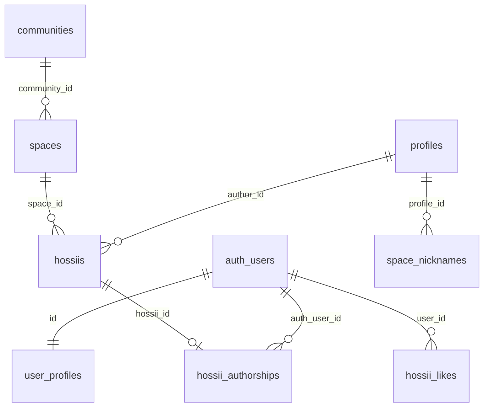

# 97: 個人アカウント・所属・個人データ基盤

> **分類:** `[Core / Identity / Account / Membership / Security]`
> **バージョン:** v0.4
> **ステータス:** Phase 1 実装可能ドラフト・Identity 保存先確定
> **対象ブランチ:** `feat/personal-account`
> **対象アプリ:** Vite + React SPA
> **認証:** Supabase Auth
> **最終コード照合:** 2026-06-27
> **Identity 保存先（正式決定）:** 案 B — 非公開 `hossii_authorships`（`hossiis.auth_user_id` は採用しない）
> **関連:**
> - [41_個人ユーザー登録](./41_個人ユーザー登録.md)
> - [43_ゲスト参加の人がアカウントからログインする](./43_ゲスト参加の人がアカウントからログインする.md)
> - [04_データ保存機能](./04_データ保存機能.md)
> - [10_ログインユーザー管理設計](./10_ログインユーザー管理設計.md)
> - [02_匿名利用機能](./02_匿名利用機能.md)
> - [16_ゲスト入室フロー](./16_ゲスト入室フロー.md)
> - [05_管理者ログイン画面](./05_管理者ログイン画面.md)
> - [83_ログ一覧の私のログ切替](./83_ログ一覧の私のログ切替.md)

---

# 0. 目的

Hossii において、一人の利用者が複数のコミュニティやスペースを横断しながら、以下を継続して持てる基盤を整備する。

* 個人プロフィール
* 自分の投稿
* 自分のリアクション
* 所属コミュニティ
* 関わったスペース
* コミュニティ・スペースごとの権限
* 将来の個人活動ログ

管理者も別種類のアカウントとして扱わず、一人の個人アカウントに管理権限が付与された状態として扱う。

Hossii の特徴である、アカウント登録をせずに URL や QR から参加できるゲスト体験は維持する。

---

# 1. 利用者の定義

Hossii の利用者を次の三つの状態として扱う。

```text
ゲスト
└ アカウントを作らず、端末プロフィールで参加する

個人ユーザー
└ Supabase Auth でログインし、端末を越えて本人データを持つ

管理者
└ 個人ユーザーにコミュニティまたはスペースの権限が付与された状態
```

管理者専用の別認証基盤は作らない。

---

# 2. 現在の Identity 構造

現在、Hossii では一人の利用者を示す情報が三系統に分かれている。

## 2.1 認証ユーザー

```text
auth.users.id
```

現在の主な用途：

* 個人ログイン（`AuthContext.login` / `signUp`）
* 管理者ログイン（`AuthContext.adminLogin` / `adminSignUp`）
* `user_profiles.id`（FK → `auth.users`）
* `communities.admin_id`
* `hossii_likes.user_id`（`LogListBody.tsx` → `toggleLike(currentUser.uid, …)`）
* `stamps.user_id`（アプリは `PostScreen.tsx` で `currentUser.uid` を使用。`stamps` テーブルコメントは `profiles.id` — §22 参照）
* `moderation_logs.admin_id`

## 2.2 ゲスト・端末プロフィール

```text
profiles.id          -- Supabase テーブル
localStorage: hossii.profile
```

現在の主な用途：

* `hossiis.author_id`
* `space_nicknames.profile_id`
* `MyLogsScreen` / `LogListBody` の mine フィルタ
* `groupHossiisByAuthor.ts`（表示グルーピング。本人判定とは別）
* ゲスト投稿

## 2.3 Onboarding 用ローカルプロフィール

```text
localStorage: profile_${auth.uid}
```

`App.tsx` の `OnboardingModal` でのみ使用され、`user_profiles` や投稿とは接続されていない。

## 2.4 現在の不整合

```text
同一人物

auth.users.id     = UUID-A
profiles.id       = DEVICE-B

投稿
hossiis.author_id = DEVICE-B

いいね
hossii_likes.user_id = UUID-A
```

このため、以下の問題が発生している。

* 別端末で自分の投稿を確認できない
* ログイン中に本人投稿を編集できない場合がある（`SpaceScreen.tsx` の `myAuthorId` バグ — §9.4）
* 投稿、いいね、スタンプを一人の活動として統合できない
* 管理者画面と個人画面の関係が分断されている
* 過去のゲスト投稿を安全に本人へ引き継げない

---

# 3. Identity 設計原則

## 3.1 正式決定：公開投稿と認証の分離（案 B）

Phase 1 の認証ユーザーと投稿の関係は、**公開テーブル `hossiis` に Supabase Auth UID を保存せず**、非公開の関連テーブル `hossii_authorships` で管理する。

```text
hossiis（公開）
├ id
├ author_id
├ author_name
└ その他の公開投稿情報

hossii_authorships（非公開）
├ hossii_id
├ auth_user_id
└ created_at
```

## 3.2 Identity の意味

```text
hossiis.author_id
= ゲスト・端末プロフィール ID（profiles.id）
= 既存表示、ニックネーム、ゲスト互換に使用

hossii_authorships.auth_user_id
= 投稿と認証アカウントの非公開な関係
= MyLogs、本人編集判定、個人データ取得に使用
```

`hossii_authorships` は、画面上の表示名や公開上の投稿者を示すテーブルではない。

Phase 1 では、**一つの投稿に一つの認証アカウント**だけが関連付く（`hossii_id` PRIMARY KEY）。

## 3.3 正式な本人 ID（認証）

ログイン済みユーザーの正式な本人 ID は `auth.users.id`。`user_profiles.id` も同一 UUID。

## 3.4 ゲスト ID

未ログイン利用者は既存の `profiles.id`（端末プロフィール）を使用する。

## 3.5 二重 Identity の併存

Phase 1 では、認証 ID と端末 ID を一つに置き換えない。

ログイン中の新規投稿では：

```text
hossiis.author_id              = profiles.id（端末）
hossii_authorships（Trigger）  = auth.uid()（非公開・別テーブル）
```

## 3.6 禁止事項

Phase 1 では、以下を行わない。

* `hossiis` に `auth_user_id` 列を追加する
* `author_id` を auth UID へ置き換える
* ログイン / signup / profile 更新で既存 `hossiis` 行を UPDATE する
* ログイン / signup で既存行へ authorship を backfill する
* localStorage の `profiles.id` だけを根拠に authorship を追加する
* `profiles.id` と `auth.users.id` を同じ値にする
* クライアントから `hossii_authorships` へ INSERT / UPDATE / DELETE する

## 3.7 カラム・テーブル意味の固定（Phase 1〜3）

| 保存先 | 意味 |
|--------|------|
| `hossiis.author_id` | ゲスト・端末プロフィール ID のみ |
| `hossii_authorships.auth_user_id` | Supabase Auth UID（非公開） |

`author_id` カラムに Auth UID を混在させてはならない。

---

# 4. Phase 1 のスコープ

Phase 1 の目的は、**個人認証導線を有効化し、今後作成される投稿を認証ユーザーへ非公開に接続すること**である。

## 4.1 スコープ内

### DB

* `hossii_authorships` テーブル追加
* authorship 作成 Trigger（`SECURITY DEFINER`）
* RLS（本人 SELECT のみ）
* 既存 `hossiis` 行への backfill は行わない

### Identity

* ログイン投稿時 Trigger による authorship 作成
* ゲスト投稿では authorship 行なし
* `myAuthorshipIds` の取得・保持
* 共通本人判定 `isOwnHossii` を追加

### 認証

* `/login` / `/signup`
* OAuth ユーザーの `user_profiles` 作成
* `ACCOUNT_AUTH_COMING_SOON` 解除

### UI・導線

* `GuestEntryScreen` / `PrivateSpaceScreen` / `AccountScreen` から login・signup
* 管理者も `#account` を利用可能

### 個人データ

* **現在読み込まれているスペース内**の MyLogs（authorship + 端末 profile）
* 本人投稿編集判定の修正

## 4.2 Phase 1 の非スコープ

* 過去投稿への authorship backfill（Phase 4）
* ゲスト投稿のアカウント引き継ぎ UI（Phase 4）
* `profile_account_links`
* `community_memberships` / `space_memberships` / `activity_events`
* 複数コミュニティ管理、非公開スペース招待制
* いいね・スタンプの Identity 全面統合
* `profile_${uid}` の削除、`communities.admin_id` 廃止
* `/me/activity` / `/me/communities` / `/me/spaces`
* パスワード再設定、メール変更、アカウント削除 UI
* **authorship Realtime publication**
* **別端末投稿の即時 MyLogs 反映**（再取得・再入室で可）
* **全スペース横断 MyLogs**（Phase 5）
* `hossii_likes.user_id` / `hidden_by` の公開問題（後続 Issue — §23）
* 投稿系 public RLS の全面改修（本番ゲート — §17）

---

# 5. Phase 1 データモデル

## 5.1 ER 図



> `hossiis` と `auth_users` の間に **直接 FK はない**。関係は `hossii_authorships` のみ。

## 5.2 `hossiis.id` の型

`20260223000000_initial_schema.sql` より：

```sql
id text primary key
```

`hossii_authorships.hossii_id` も **`text`** とする。

## 5.3 `hossii_authorships` 目標スキーマ

```sql
create table public.hossii_authorships (
  hossii_id text
    primary key
    references public.hossiis(id)
    on delete cascade,

  auth_user_id uuid
    not null
    references auth.users(id)
    on delete cascade,

  created_at timestamptz
    not null
    default now()
);

create index hossii_authorships_auth_user_created_idx
  on public.hossii_authorships (auth_user_id, created_at desc);
```

`hossii_id` の PRIMARY KEY により、Phase 1 では一投稿一アカウントを保証する。

## 5.4 保存規則

### ゲスト投稿

```text
hossiis INSERT（author_id = profiles.id）
→ auth.uid() = null
→ authorship 行なし
```

### ログインユーザー投稿

```text
hossiis INSERT（author_id = profiles.id）
→ auth.uid() あり
→ Trigger が hossii_authorships 行を同一トランザクションで作成
```

## 5.5 authorship の意味

**投稿操作を行った認証ユーザー**との非公開な関係（作成時点）。表示名（`author_name`）や匿名表示とは別概念。

作成後に authorship 行を UPDATE しない（引き継ぎは Phase 4 で新規 INSERT）。

## 5.6 Listen・表示名上書き

`hossii_authorships` は画面上の表示名ではなく、**認証されたクライアントから `hossiis` INSERT された操作**と Auth の関係を表す。

Phase 1 では、**`auth.uid()` が non-null の認証 INSERT** について、`authorNameOverride` の有無にかかわらず authorship を作成する。

例外（authorship を作らない）：

* `auth.uid() = null` のゲスト投稿
* service role や DB バッチなど、セッションに Auth UID が存在しないシステム生成

`author_id` が null の匿名表示投稿でも、上記例外に該当しなければ authorship は作成される。

## 5.7 アカウント削除

```text
auth.users 削除
→ hossii_authorships は ON DELETE CASCADE で削除
→ hossiis 投稿本体は残る
```

投稿の `author_id`、`author_name`、内容は別の削除処理がない限り維持する。

---

# 6. RLS と権限（`hossii_authorships`）

`hossii_authorships` は**非公開テーブル**とする。

## 6.1 SELECT

認証ユーザーは**自分の行だけ**読める。

```sql
create policy "authorships_select_own"
  on public.hossii_authorships
  for select
  using (auth_user_id = auth.uid());
```

## 6.2 クライアントから禁止する操作

* INSERT
* UPDATE
* DELETE

**INSERT policy は作らない。** Trigger 関数（`SECURITY DEFINER`）のみが INSERT する。

## 6.3 ロールと GRANT

* **anon へ `hossii_authorships` の権限を付与しない**（未ログイン JWT では SELECT 不可）
* **authenticated は SELECT のみ**（RLS により本人行に限定）
* 公開投稿取得（`hossiis` の `select('*')`）のレスポンスに **authorship を JOIN して含めない**
* Realtime の `hossiis` payload に Auth UID は含まれない（`hossiis` に列がないため）

## 6.4 `hossiis` 側（現状維持・Phase 1）

`"public read hossiis"` 等の既存ポリシーは Phase 1 では変更しない（§17 本番ゲートで整理）。

---

# 7. Trigger（authorship 作成）

## 7.1 要件

ログインユーザーの `hossiis` INSERT 時に、**同一トランザクション内**で authorship を作成する。

| 要件 | 内容 |
|------|------|
| タイミング | `AFTER INSERT FOR EACH ROW` |
| 条件 | `auth.uid()` が null でない場合のみ |
| ゲスト | authorship 行を作らない |
| セキュリティ | `SECURITY DEFINER` |
| search_path | 安全な固定値（例: `SET search_path = public`） |
| 修飾 | テーブル・関数は完全修飾（`public.`） |
| UID 来源 | **セッションの `auth.uid()` のみ**。クライアント payload は使わない |
| 失敗時 | authorship 作成失敗 → **投稿 INSERT 全体がロールバック** |
| 競合 | 不要な `ON CONFLICT DO NOTHING` は使わない |

## 7.2 命名候補（既存 migration 規則に合わせる）

既存例：`update_like_count()` + `hossii_likes_update_count`、`assert_hossii_pane_space_match()`（`20260629000000_add_space_panes.sql`）。

| 種別 | 候補名 |
|------|--------|
| 関数 | `public.link_hossii_authorship_after_insert()` |
| Trigger | `hossiis_after_insert_link_authorship` |
| migration ファイル（実装時） | `YYYYMMDD_add_hossii_authorships.sql` 等 |

この段階では SQL ファイルは作成しない。

## 7.3 概念 SQL（仕様用・未適用）

```sql
-- 概念のみ。実装時に search_path・権限・OWNER を確定する。
create or replace function public.link_hossii_authorship_after_insert()
returns trigger
language plpgsql
security definer
set search_path = public
as $$
begin
  if auth.uid() is not null then
    insert into public.hossii_authorships (hossii_id, auth_user_id)
    values (new.id, auth.uid());
  end if;
  return new;
end;
$$;

create trigger hossiis_after_insert_link_authorship
  after insert on public.hossiis
  for each row
  execute function public.link_hossii_authorship_after_insert();
```

---

# 8. 投稿作成（クライアント）

Phase 1 でもクライアントは従来どおり **`hossiis` へ 1 回だけ INSERT** する（`hossiisApi.insertHossii`）。

## 8.1 フロー

```text
HossiiStoreProvider.addHossii
↓
profiles.id を取得または作成
↓
hossiisApi.insertHossii（author_id, author_name 等のみ）
↓
（ログイン時）DB Trigger が authorship 作成
↓
（任意）投稿成功後 myAuthorshipIds に hossii.id を追加
```

## 8.2 変更しないもの

* `hossiisApi.ts` の INSERT payload に **Auth UID を含めない**
* `Hossii` / `HossiiRow` / `rowToHossii` に **Auth UID フィールドを追加しない**
* Realtime の `hossiis` 変換ロジックは auth 列なしのまま

## 8.3 過去投稿・副作用禁止

以下から **`hossiis` の UPDATE** および **authorship の手動追加** を行わない。

* login / signup / OAuth
* profile 作成、nickname 更新
* MyLogs 表示、Realtime 受信、`onAuthStateChange`

authorship が付くのは **ログインセッション付きの新規 `hossiis` INSERT → Trigger** のみ。

---

# 9. 本人判定

## 9.1 共通関数

```ts
// src/core/utils/isOwnHossii.ts（新規）
export function isOwnHossii(
  hossii: { id: string; authorId?: string },
  myAuthorshipIds: ReadonlySet<string>,
  guestProfileId?: string,
): boolean {
  if (myAuthorshipIds.has(hossii.id)) return true;
  if (guestProfileId && hossii.authorId === guestProfileId) return true;
  return false;
}
```

純関数。React hook にはしない。

## 9.2 Phase 1 で適用する箇所

* バブル編集（色・位置・スケール）— `SpaceScreen.tsx` `canEditBubble`
* MyLogs — `MyLogsScreen.tsx`
* comments mine — `LogListBody.tsx`

## 9.3 適用しない箇所

* 非表示（`hideHossii`）
* pane 移動（`LogListBody` `showMovePane`）
* モデレーション（`ModerationTab`）
* 管理者による削除・復元

## 9.4 既知バグの修正

現状 `myAuthorId = currentUser?.uid ?? profile?.id`（`SpaceScreen.tsx` L238）により owner 編集不可。

Phase 1 では `isOwnHossii` + `myAuthorshipIds` に置き換える。

---

# 10. Authorship 取得

## 10.1 Realtime

Phase 1 では **`supabase_realtime` publication に `hossii_authorships` を追加しない**。

## 10.2 取得タイミング

* ログイン完了時
* 認証セッション復元時（`onAuthStateChange` INITIAL_SESSION 等）
* 対象スペース入室時
* MyLogs 表示時

## 10.3 API

`src/core/utils/hossiiAuthorshipsApi.ts`（新規）：

```text
fetchMyAuthorshipIdsForSpace(spaceId)
  → hossii_authorships を hossiis と inner join し space_id で絞る
  ※ RLS により auth.uid() 本人行のみ返る（引数に Auth UID を渡さない）
```

## 10.4 保持場所（Phase 1 確定）

**`HossiiStoreProvider`** で `myAuthorshipIds: Set<string>` を保持する。

| レイヤ | 責務 |
|--------|------|
| `AuthContext` | 認証セッション、`currentUser`、`user_profiles`、管理権限 |
| `HossiiStoreProvider` | 現在スペース、投稿、端末 profile、`myAuthorshipIds`、本人投稿判定の入力 |

理由：authorship は読み込み中の投稿・スペースに紐づく状態であり、スペース切替時に再取得・クリアが必要。認証層へ投稿データ責務を混ぜない。

## 10.5 楽観的更新

自分が新規投稿した場合、INSERT 成功後に **`myAuthorshipIds` へ当該 `hossii.id` を追加してよい**。

## 10.6 別端末

別端末で作成された投稿の **即時** MyLogs 反映は Phase 1 受入条件に**含めない**。再取得または再入室後に表示できればよい。

---

# 11. MyLogs（Phase 1 範囲）

## 11.1 対象スペース

Phase 1 の MyLogs は **現在読み込まれているスペース内** の投稿に限定する。

```text
現在スペースの hossiis（state / fetch 済み）
×
isOwnHossii（myAuthorshipIds + profile.id）
```

## 11.2 表示内容

```text
myAuthorshipIds に含まれる投稿（ログイン後に作成・同一スペース内で取得済み）
+
author_id === 現在端末 profile.id の投稿
```

重複は `hossii.id` で排除。

## 11.3 Phase 5 へ送るもの

* 全コミュニティ横断ログ
* 全スペース横断ログ
* いいね・スタンプを含む統合タイムライン
* アカウントホームからの全活動取得

## 11.4 非表示投稿

現状 MyLogs は `coerceIsHidden` を一覧に未適用。Phase 1 では維持。

---

# 12. 個人認証・導線

## 12.1 認証基盤

`AuthContext.tsx` — 個人 / 管理者 / OAuth 共通 `auth.users`。

## 12.2 URL（pathname）

Phase 1 追加：`/login`、`/signup`

既存：`/admin/login`、`/s/{spaceSlug}`、`/c/{communitySlug}/s/{spaceSlug}`

Hash：`#account`、`#comments`、`#mylogs`

`/me` → `/#account` リダイレクトは任意。

## 12.3 OAuth `user_profiles`

`resolveAppUser()` 内で不足時のみ `upsertUserProfile`（v0.3 と同様）。

## 12.4 ゲスト導線

`ACCOUNT_AUTH_COMING_SOON` 解除と同時に GuestEntry / PrivateSpace / Account / `/login` / `/signup` を公開（[43](./43_ゲスト参加の人がアカウントからログインする.md)）。

---

# 13. 個人アカウント画面

`#account`（`AccountScreen.tsx`）。Phase 1 で新規プロフィール項目 UI は追加しない。

---

# 14. 管理者との共存

`/admin/login` 維持。管理者も個人として authorship 付き投稿可能。

`communityStatus === 'pending' | 'rejected'` の全画面ブロックは Phase 1 では変更しない。

---

# 15. Private Space

未ログイン → `PrivateSpaceScreen`。ログイン済み → `isPrivate` チェックなしで入室（現状維持）。

Phase 1 では未ログイン側ログイン導線のみ修正。

---

# 16. Phase 4 ゲスト引き継ぎ（案 B 前提）

```text
過去の hossii 行は UPDATE しない
↓
安全な本人確認（Phase 4：RPC または Edge Function）
↓
hossii_authorships 行を INSERT
```

* localStorage の profile ID だけを根拠に authorship を追加してはならない
* 引き継ぎ用 RPC / Edge Function は **Phase 4 で設計**
* Phase 1 では実装しない

---

# 17. RLS と本番公開ゲート（`hossiis` 等）

Phase 1 dev/test では `hossiis` public RLS は変更しない。

`hossii_authorships` は §6 のとおり Phase 1 migration で保護する。

本番ゲート（最低条件）は v0.3 と同様に `spaces` public 整理、`moderation_logs` RLS、`hossiis` UPDATE/DELETE 方針等。詳細は §16.2 ポリシー一覧（`20260223000000_initial_schema.sql` 等）を参照。

---

# 18. Phase 1 変更ファイル（候補）

実装時に最終決定。**候補**として記載。

| ファイル | 変更内容 |
|----------|----------|
| `supabase/migrations/..._add_hossii_authorships.sql` | テーブル、index、RLS、Trigger 関数・Trigger |
| `src/core/utils/hossiiAuthorshipsApi.ts` | authorship id 取得（**新規**） |
| `src/core/utils/isOwnHossii.ts` | 本人判定（**新規**） |
| `src/core/hooks/HossiiStoreProvider.tsx` | `myAuthorshipIds` 取得・保持、投稿成功後の id 追加 |
| `src/components/SpaceScreen/SpaceScreen.tsx` | `canEditBubble` |
| `src/components/MyLogsScreen/MyLogsScreen.tsx` | authorship + profile 判定 |
| `src/components/CommentsScreen/LogListBody.tsx` | mine 判定 |
| `src/core/contexts/AuthContext.tsx` | OAuth `user_profiles` 補完 |
| `src/core/config/features.ts` | 個人 Auth 有効化 |
| `src/components/Auth/GuestEntryScreen.tsx` + `.module.css` | login/signup 配線 |
| `src/App.tsx` | `/login`、`/signup`、private 復帰 |
| `src/components/AccountScreen/AccountScreen.tsx` | 表示確認 |

**Phase 1 で変更しない（v0.4 で削除した案 A 関連）：**

| ファイル | 理由 |
|----------|------|
| `src/core/types/index.ts` | `Hossii.authUserId` を追加しない |
| `src/core/utils/hossiisApi.ts` | `HossiiRow` / `rowToHossii` / INSERT に Auth UID なし |
| `..._add_hossiis_auth_user_id.sql` | **採用しない** |

原則変更しない：`AdminLoginScreen.tsx`、`LoginScreen.tsx`、`groupHossiisByAuthor.ts`、`PrivateSpaceScreen.tsx`（App 側で足りる場合）。

---

# 19. Phase 1 受入条件

## 19.1 ゲスト

* 公開スペース入室、投稿、`author_id` 保存
* **authorship 行が作成されない**
* MyLogs（端末 profile 分）に表示
* 個人登録を強制されない

## 19.2 メール / OAuth アカウント

* `/signup` / `/login`、OAuth、`user_profiles`
* ログイン新規投稿で **authorship 行が作成される**
* **公開 `hossiis` REST レスポンスに Auth UID が存在しない**
* **Realtime `hossiis` payload に Auth UID が存在しない**
* **別端末で同一スペースへ入室・再取得すれば、本人 authorship 投稿が MyLogs に表示される**（即時同期は不要）
* `owner_and_admin` 時に本人編集可能

## 19.3 authorship セキュリティ

* 未ログインユーザーが `hossii_authorships` を取得できない
* ログインユーザーが**他人の** authorship を取得できない
* ログインユーザーが**自分の** authorship のみ取得できる
* authorship 作成失敗時、**投稿だけが残らない**（トランザクションロールバック）

## 19.4 アカウント削除

* `auth.users` 削除後、authorship は CASCADE 削除
* **投稿本体（`hossiis`）は残る**

## 19.5 MyLogs

* authorship と端末 profile の **両方**を判定できる

## 19.6 管理者・Private Space・回帰

v0.3 §18.4–18.6 と同趣旨（`auth_user_id` 表現を authorship に読み替え）。

---

# 20. Phase 1 テスト

## 自動

* `isOwnHossii`（authorship id / profile id / 不一致）
* MyLogs 重複排除
* OAuth 初期 username

## DB / 結合

* ゲスト投稿 → authorship なし
* ログイン投稿 → authorship 1 行
* 既存 `hossiis` 行 → authorship 変更なし
* Trigger 失敗時 → `hossiis` も残らない
* アカウント削除 → authorship 削除、`hossiis` 残存

## 手動 / Network

* `hossiis` API レスポンスに `auth_user_id` キーがない
* Realtime INSERT payload に Auth UID がない
* 別ブラウザ同一スペース再入室 → MyLogs
* private 復帰、`/admin/login`、管理者 CRUD

## ビルド

`npm run lint`、`npm run build`、既存 test

---

# 21. Phase 2 以降

## Phase 2：Community Membership

`community_memberships`（`communities.admin_id` 移行期間維持）。v0.3 最小スキーマ参考は Phase 2 実装時。

## Phase 3：Space Access

private space 意味確定、`space_memberships`（要件確定時）。

## Phase 4：ゲストデータ引き継ぎ

§16。authorship 行の安全な追加。RPC / Edge Function。

## Phase 5：個人活動ログ

全スペース横断、いいね・スタンプ統合、`activity_events` は必要時のみ。

## Phase 6–7：RLS 統合、旧構造整理

## 21.8 `author_id` 廃止の前提

ゲスト Identity 所有証明、Phase 4 引き継ぎ、`space_nicknames` 移行、MyLogs auth ベース移行、likes/stamps 統合、本番 RLS 整備の後にのみ検討。

---

# 22. 未確定事項

* 本番公開ゲートの環境判定方法
* `/me` pathname 化時期
* OAuth 初期 username の UI 表示
* 投稿者別グループの auth 統合時期
* MyLogs で非表示投稿を見せるか
* `profile_${uid}` の去就
* private space：ログイン必須 vs membership 必須
* authorship Realtime 追加時期（Phase 1 以降）
* `AccountScreen` への MyLogs リンク要否

---

# 23. 後続 Issue（Phase 1 非スコープ）

以下は Phase 1 に含めず、既知課題として記録する。

| Issue | 内容 |
|-------|------|
| L-1 | `hossii_likes.user_id` の public SELECT（`"hossii_likes_select_all"`） |
| L-2 | `hossiis.hidden_by` による Auth UID 公開 |
| L-3 | `hossiis` / `profiles` / `space_nicknames` の demo 用 public RLS 全面改修 |
| L-4 | authorship Realtime publication |
| L-5 | account-wide 活動ログ（Phase 5） |
| L-6 | ゲスト profile 所有権証明（Phase 4 前提） |
| L-7 | `community_memberships` / `space_memberships` |

---

# 24. Phase 1 実装開始条件

* [ ] **`hossiis` に Auth UID 列を追加しない**（案 B 確定）
* [ ] authorship は Trigger のみ INSERT、クライアント INSERT 禁止
* [ ] 過去投稿へ authorship backfill しない
* [ ] `author_id` を維持する
* [ ] 本人判定は `myAuthorshipIds` + `profile.id`
* [ ] 非表示・pane 移動・モデレーションは管理者権限維持
* [ ] OAuth プロフィール補完は `resolveAppUser` 内
* [ ] `/login` と `/signup` のみ pathname 化
* [ ] `#account` を個人ホームとして利用
* [ ] memberships / authorship Realtime / 横断 MyLogs は Phase 1 に含めない
* [ ] `hossiis` public RLS 改修と本番公開は別ゲート
* [ ] 個人 Auth フラグと GuestEntryScreen を同時公開

---

# 付録 A: コード索引

| 概念 | パス |
|------|------|
| Auth | `src/core/contexts/AuthContext.tsx` |
| 投稿 INSERT | `src/core/utils/hossiisApi.ts` `insertHossii` |
| 投稿追加 | `src/core/hooks/HossiiStoreProvider.tsx` `addHossii` |
| Realtime | `HossiiStoreProvider.tsx` L1003–1082（`hossiis` のみ） |
| 機能フラグ | `src/core/config/features.ts` |
| `hossiis.id` 型 | `supabase/migrations/20260223000000_initial_schema.sql` L52 |

# 付録 B: v0.3 → v0.4 変更ログ

| 項目 | v0.3 | v0.4 |
|------|------|------|
| Identity 保存 | `hossiis.auth_user_id` | `hossii_authorships` |
| `Hossii.authUserId` | 追加予定 | **追加しない** |
| authorship 作成 | クライアント INSERT | **Trigger のみ** |
| Auth UID 公開 | あり得る | **公開面から排除** |
| MyLogs 別端末 | 即時想定 | **再入室・再取得で可** |
| MyLogs 範囲 | 曖昧 | **現在スペース内** |
